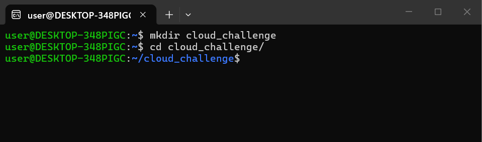
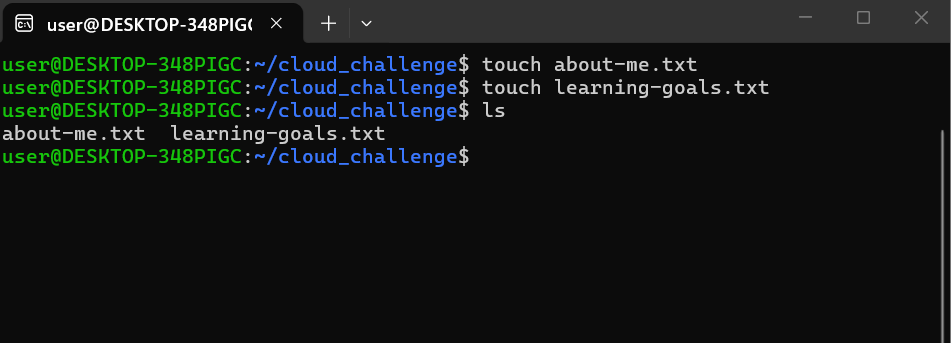
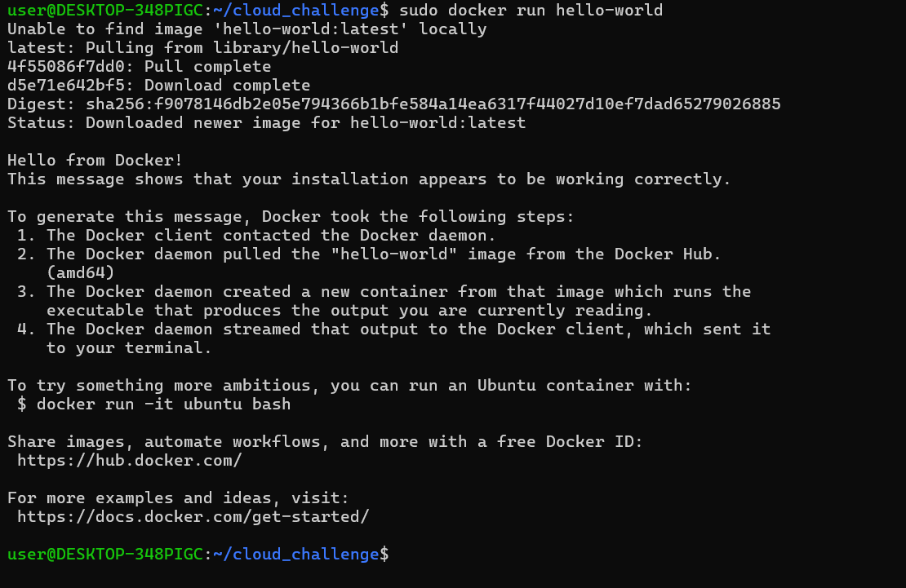

PART 1-Linux fundamentals
in this part we created a directory by the name cloud-challenge using the MKDIR command

and then created two files using TOUCH command and also read the files using the CAT command.

PART 2- Git and Github

On this part we created a repository cloud_engineering_repository.
The:
"git init" turns the cloud-challenge directory into a git repository, internally it creates a hidden folder called .git/, starts version control for that particular project and it allows git to keep track of the changes on the file. we also udes the
"git add ." this command helps prepare the changes in the current directory(.) for saving, it moves all the files from the current directory into the staging area.
"git commit" this command takes evrything saved on the staging area and stores it permanently in the local Git repository

PART 3- BRANCHING CHALLENGE
To create a new branch we use the command "git checkout"  in our case we did "git checkout -b update-learning-goal" creates a new branch update-learning- goals and switched us to the branch immediately.

PART 4- BASIC RESEARCH TASK
1. What is cloud computing?
This is the delivery of IT services like database,servers,networking over the internet
3. What is DevOps?
   is a software development methodology that unites development and operations team to deliver software faster, more securely and more efficiently.
5. Difference between Docker and Kubernetes?
   docker is used to create and package applications into "containers," while kubernetes is used to manage and coodinate those containers across different servers
7. Why are Linux skills important in cloud engineering?
   this is because linux runs most of the cloud workloads for instance, kubernetes and containers run on linux.

PART 5- PROBLEM SOLVING QUESTIONS
 A cloud server becomes inaccessible. what are 3 things you would do first?
 1. Network connectivity:
    check whether the server is reachable by pinging the server,ssh or rdp
2. server status and resource usage.
   find out if the virtual machine is running in the cloud dashboard
   check if the resources have been exhausted like the cpu, ram and disk usage
   inspect the logs for unexpected shutdown
3.  cloud provider services and monitoring
    confirm if there are no ongoing platform issues affecting the region or availaility zone.

PART 6- BONUS CHALLENGE
We installed docker using the command "sudo apt install docker.io"
then we did "sudo docker run hello-world"  we used sudo because docker needs system privileges  since docker daemon runs with restricted access.
"docker" this is the cli client that talks to the Docker engine(daemon).
"run" creates and starts a container.
"hello-docker" the docker image name.

